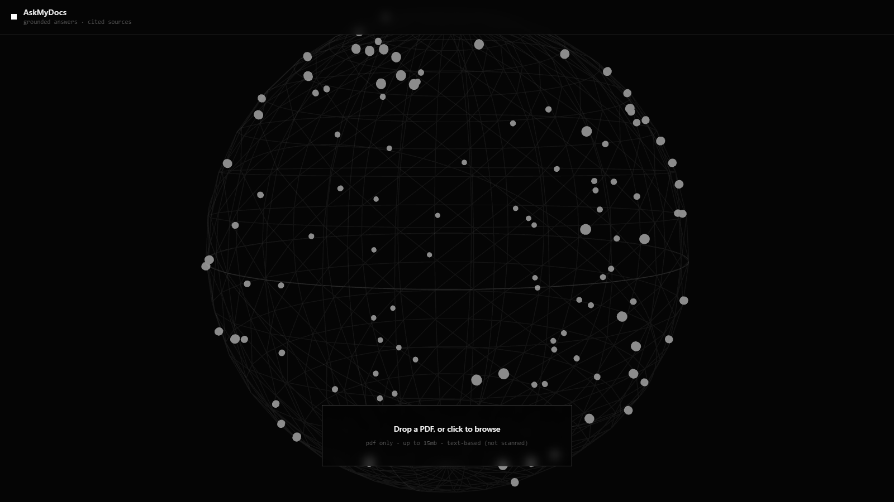

# AskMyDocs

Upload a PDF, ask it questions, get answers with citations that point at the exact passage. If the answer isn't in the document, it tells you that instead of making something up.

**Live demo:** https://askmydocs-xx7m.onrender.com — free hosting, so the first visit can take up to a minute while the server wakes up. The app tells you when that's happening.
**Stack:** Node + Express · React (Vite) + Tailwind · Groq (Llama 3.3 70B) · Cohere embeddings · HNSW · three.js



## Why I built this

This is my first RAG project. I wanted to actually understand retrieval-augmented generation, so I built every stage myself instead of importing LangChain and hoping for the best.

The problem with using a normal chatbot on your own documents is that it guesses. Ask it about *your* warranty terms and it will confidently invent some. Everything in this project exists to fix that: answers come only from the document, every claim carries a citation you can check, and off-topic questions get a refusal. I tested the refusal part the hardest because a wrong answer that sounds right is worse than no answer.

## What it does

- Chat with one or more PDFs, answers streamed token by token over SSE
- Every answer cites sources like [1], [2] — expand them to see the passage, the file it came from, and its similarity score
- Off-topic questions get "I couldn't find that in the document." (verified, not assumed)
- Follow-ups work: "what voids it?" is rewritten into a standalone question before retrieval
- Each upload generates 3 clickable starter questions
- Sessions survive server restarts because the vector index is saved to disk
- A 3D globe that renders the real vector index — every chunk is a point in space, and retrieved chunks flash red when you ask something
- Per-IP rate limits, because the public demo runs on my API keys

## New to RAG? The five words you need

I didn't know most of these when I started, so here they are the way I'd explain them to a friend:

- **Embedding** — a list of numbers (here, 1024 of them) that represents the *meaning* of a piece of text. Texts that mean similar things get similar numbers. "What's the refund policy?" and "items may be returned within 30 days" share almost no words, but their embeddings sit close together.
- **Vector** — just the math name for that list of numbers. Embedding = vector, used interchangeably.
- **Cosine similarity** — how you measure "close together" for two vectors. Score near 1 means same meaning, near 0 means unrelated. This is the entire search mechanism: no keywords, just meaning.
- **Chunking** — cutting the document into ~500-token pieces before embedding. One vector can't faithfully represent a 50-page PDF, but it can represent two paragraphs.
- **Hallucination** — when a language model fills a gap with confident fiction. The fix here is called *grounding*: the model only sees the retrieved chunks and is told to refuse if the answer isn't in them.

Two smaller ones you'll see below: **temperature** controls how creative the model is allowed to be (0.1 ≈ stick to the facts), and **SSE** (Server-Sent Events) is the plain-HTTP way the server streams the answer word by word to the browser.

## How the pipeline works

```
                         INGESTION (per upload)
┌─────────┐   ┌──────────┐   ┌─────────────┐   ┌──────────────────┐
│  1 LOAD │ → │ 2 CHUNK  │ → │  3 EMBED    │ → │  4 STORE         │
│ pdf-parse│  │ ~500 tok │   │ Cohere v3   │   │ HNSW index +     │
│ PDF→text│   │ 50 overlap│  │ 1024-d vecs │   │ metadata array   │
└─────────┘   └──────────┘   └─────────────┘   └──────────────────┘
                                                        │
                         QUERY (per question)           ▼
┌──────────┐   ┌────────────────┐   ┌──────────────────────────────┐
│ question │ → │ 5 RETRIEVE     │ → │ 6 GENERATE                   │
│          │   │ embed question,│   │ Groq Llama 3.3 70B, temp 0.1 │
│          │   │ cosine top-4   │   │ answers ONLY from context,   │
│          │   │ chunks         │   │ cites [n], refuses if absent │
└──────────┘   └────────────────┘   └──────────────────────────────┘
```

In plain words: the PDF becomes text, the text becomes ~500-token chunks split on sentence boundaries, each chunk becomes a 1024-dimension vector. When you ask something, your question becomes a vector too, and cosine similarity finds the 4 closest chunks. Those chunks go into the prompt as numbered context, and the model is only allowed to answer from them.

The retrieved chunks are sent to the browser before the answer starts streaming, so citations render instantly.

## The globe is real data, not decoration

My favorite part. Each chunk's 1024-d embedding is projected onto 3 fixed random axes and normalized onto a sphere ([lib/projection.js](lib/projection.js)). Random projection roughly preserves angles, so chunks about the same topic land near each other.

On upload the points fly into position. When you ask a question, the top-4 retrieved chunks pulse red for a few seconds. You're watching the cosine similarity search happen.

three.js loads lazily in its own bundle (~220KB gzipped) so the chat UI stays fast. No WebGL, or `prefers-reduced-motion` set? You get a static fallback instead of a crash.

## Decisions I made and why

**Cohere API instead of a local embedding model.** A local model wants 500MB+ of RAM and free hosting gives you 512MB total. API embeddings keep the server small enough to deploy anywhere. Cohere v3 also embeds documents and queries asymmetrically (`input_type: search_document` vs `search_query`), which retrieves better than treating both the same.

**Temperature 0.1.** I want the model to repeat what the document says, not get creative with it.

**Chunks of 500 tokens with 50 overlap.** Bigger chunks mean one vector has to represent too many topics, so retrieval gets blurry. Smaller chunks retrieve sharply but lose surrounding context. The overlap is there so a fact sitting on a chunk boundary survives whole in at least one chunk.

**HNSW in-process instead of a vector database.** HNSW is a graph structure that finds the nearest vectors without comparing your query against every stored one — it's what's inside most dedicated vector databases. For a handful of PDFs, running a separate DB is infrastructure for its own sake, so I use `hnswlib-node` in the same process, and the index serializes to disk so sessions outlive restarts.

**Query rewriting for follow-ups.** Retrieval embeds each question alone, so "what voids it?" matches nothing. One small LLM call rewrites follow-ups into standalone questions using recent chat history. Cheapest fix for the most common way conversational RAG breaks.

**Rate limits before going public, not after.** Anyone hitting the demo is spending my Groq and Cohere quota. 10 uploads/hour and 30 questions/15min per IP, plus max 5 documents per session.

## Things that broke while building this

- `pdf-parse` crashes under ES modules because its entry file runs debug code on import. Importing `pdf-parse/lib/pdf-parse.js` directly skips it.
- My first generated test PDF failed with "bad XRef entry". pdf-parse uses an old PDF.js build that chokes on newer PDF output. Regenerating the file with a different library fixed it.
- `hnswlib-node` is a native C++ module. On Windows that means installing the Visual Studio build tools first; in Docker and on Render it just compiles.
- I installed three.js while the Vite dev server was running and got "Invalid hook call" everywhere — a stale prebundle cache had two copies of React. Deleting `node_modules/.vite` fixed it.
- Llama writes clipped questions like "What is warranty length?" unless the prompt shows it one example of a fluent question. Prompt iteration is real work.

## Run it locally

You need Node 18+, a free [Groq key](https://console.groq.com/keys) and a free [Cohere key](https://dashboard.cohere.com/api-keys).

```bash
# backend
cp .env.example .env        # paste your two keys into .env
npm install
npm start                   # → http://localhost:3001

# frontend (second terminal)
cd frontend
npm install
npm run dev                 # → http://localhost:5173
```

### Or with Docker

```bash
cp .env.example .env        # paste your keys
docker compose up -d --build
# → http://localhost:3001   (UI + API on one port)
```

The container restarts itself after crashes and reboots, and sessions persist in `./data`.

## Try it

Two sample manuals are included:

- `sample.pdf` — a standing desk manual. Ask *"What does error code E02 mean?"* or *"Explain the return policy in full detail."*
- `sample2.pdf` — an espresso machine guide. Add it with **+ add pdf**, ask *"How often should I descale?"*, and check that the citation names the right file.

Then try to break it: ask *"Who is the CEO?"* It isn't in either document, and the app should say exactly that.

## Deploying

See [DEPLOYMENT.md](DEPLOYMENT.md) — one-service Render blueprint, Render + Vercel split, or any Docker host.

## Project layout

```
config.js            all the tunable numbers (chunk size, top-K, temperature, limits)
lib/loader.js        stage 1 — PDF → text
lib/chunker.js       stage 2 — sentence-aware overlapping chunks
lib/embedder.js      stage 3 — Cohere embeddings (document/query asymmetry)
lib/vectorStore.js   stages 4+5 — HNSW index + metadata, save/load
lib/rag.js           stage 6 — grounded generation, rewriting, suggestions
lib/projection.js    1024-d → 3D for the globe
lib/sessions.js      session cache + disk persistence + lazy reload
server.js            Express: upload, SSE chat, health, rate limits, static UI
ingest.js            CLI: run the whole pipeline from a terminal
frontend/            React chat UI + the three.js globe
```
